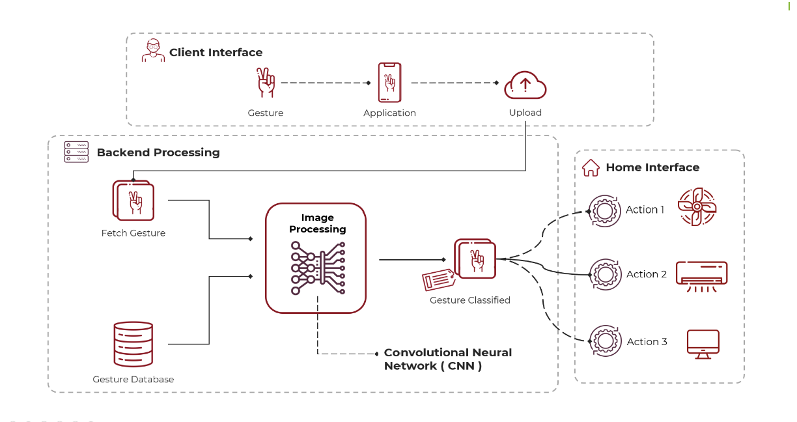

# Gesture Based Home Automation using CNN

## Overview

This project aims to automate a homes leveraging gesture recognition via an Android app, aiming to assist the elderly and physically challenged in controlling home appliances easily. It contrasts previous accelerometer-based methods with its innovative approach using a smartphone camera for gesture input, processed by a Convolutional Neural Network (CNN) to command appliances through a Raspberry Pi. The system emphasizes flexibility, portability, and the elimination of complex cabling, offering an inclusive solution for effortless appliance control.

## Objective

- Enhancing the accessibility of home appliances for the elderly and physically challenged through an Android app.
- Employing a Convolutional Neural Network (CNN) for reliable gesture recognition to control appliances.
- Offering a flexible and portable alternative to traditional home automation methods.
- Providing a user-friendly interface to interact with home environments without the need for physical contact or complex installations.
- Utilizing standard hardware like smartphones and Raspberry Pi to implement cost-effective home automation solutions.

## Authors

- [@abolipathak](https://github.com/abolipathak)

- Ninad Kheratkar , Sushmita Nooka , Shreyash Kumbhar

## Installation

</p>

Libraries Used

```bash
%matplotlib inline
from google.colab import files
import os
import tensorflow as tf
from tensorflow import keras
import numpy as np
import matplotlib.pyplot as plt
import cv2
import pandas as pd
from sklearn.model_selection import train_test_split 
from sklearn.metrics import confusion_matrix
```
 
## Proposed System 

- The system recognizes input gestures through any smartphone camera, enhancing accessibility and convenience.
- Users perform gestures, such as hand waves, in front of the camera, which captures these movements for processing.
- The captured image is analyzed to extract specific features, which are then compared to a pre-existing dataset within the system.
- Utilizing advanced machine learning algorithms, the system accurately interprets the gesture and executes corresponding commands.
- Emphasizing inclusivity, the system leverages the built-in camera of cellular phones, offering significant assistance to the impaired and physically challenged.

## Architecture Diagram

<p align="center">
  
</p>


## Hardware Requirements

- Raspberry Pi II
- Desktop / Laptop with 8GB RAM
- Relay Module
- Bulb
- Fan
- Breadboard
- Jumper wires

## Software Requirements 

- Google Colaboratory
- Android Studio
- Operating system Windows / Linux
- Dataset for training

## Project Modules 

<p align="center">
  
</p>


## Project Data Flow

<p align="center">
  
</p>

## Risk Assessment

<p align="center">
  
</p>

## Published paper links :

- https://ieeexplore.ieee.org/document/9121058
- https://www.irjet.net/archives/V7/i3/IRJET-V7I31085.pdf
